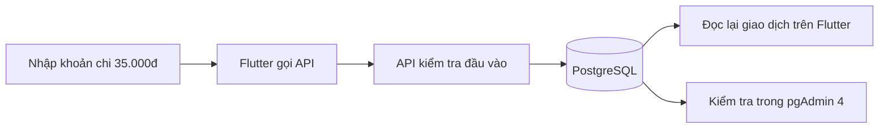
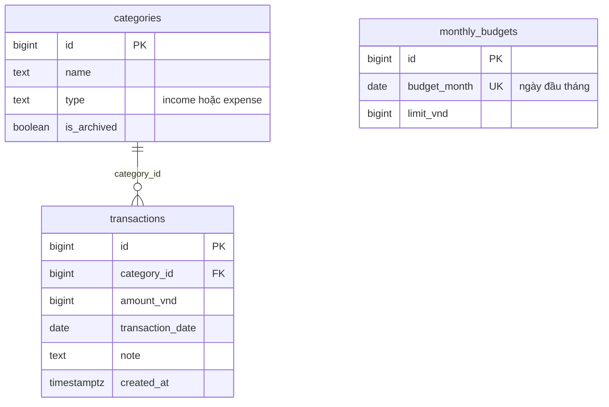

# Ví Sinh Viên — phạm vi bản đầu

Ứng dụng cho **một người dùng**, không đăng nhập. Flutter chỉ gọi HTTP tới
ASP.NET Core API. API dùng EF Core + Npgsql để đọc/ghi PostgreSQL `student_finance`.
pgAdmin 4 dùng quản lý và kiểm tra database. Không dùng SQLite.

## Chức năng và tiêu chí

| Phần | Hoàn thành khi |
|---|---|
| Giao dịch | Thêm, đọc, sửa, xóa có xác nhận; tiền nguyên VND > 0; ngày hợp lệ |
| Bộ lọc | Kết hợp tháng, loại, danh mục, từ khóa; có phân trang |
| Danh mục | Thêm, đổi tên, lưu trữ; giao dịch cũ vẫn được giữ |
| Báo cáo | Tổng thu, tổng chi, chênh lệch và biểu đồ chi theo danh mục đúng tháng |
| Ngân sách | Một hạn mức/tháng; cảnh báo từ 80%, đạt 100%, vượt 100% |
| Mạng | Báo lỗi khi API không hoạt động; giữ form; khóa nút lưu khi đang gửi |

## Màn hình đơn giản

- Tổng quan: chọn tháng, ba số tổng, ngân sách, biểu đồ danh mục.
- Giao dịch: tìm kiếm, bộ lọc, danh sách và nút thêm; bấm dòng để sửa.
- Form: loại, danh mục, số tiền, ngày, ghi chú, nút lưu/xóa.
- Danh mục: thêm, đổi tên, lưu trữ.

## Luồng sử dụng

## Thiết kế dữ liệu

Migration EF Core là nguồn cấu trúc database; SQL xuất từ migration dành cho
pgAdmin. Ngân sách tính bằng **tổng chi**, chênh lệch bằng **thu − chi**.

## Mốc Git theo lộ trình

1. Chuẩn bị: yêu cầu, cấu trúc và PostgreSQL/pgAdmin.
2. Database + API: migration, danh mục, luồng thêm/đọc; sau đó sửa/xóa/lọc và báo cáo.
3. Flutter: thêm/đọc rồi hoàn thiện sửa/xóa/lọc/danh mục.
4. Tổng quan, ngân sách, biểu đồ; kiểm thử và tài liệu chạy.

Mỗi mốc được kiểm tra trước khi commit và push. Kế hoạch 5 tuần trong đề bài
là lịch học tham khảo; mã được chia thành các mốc nhỏ để dễ xem lại.
